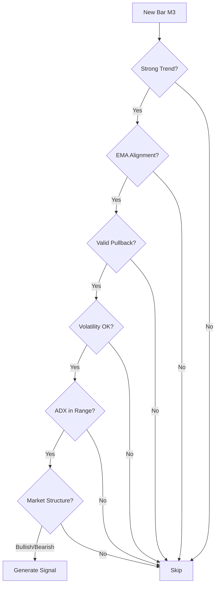
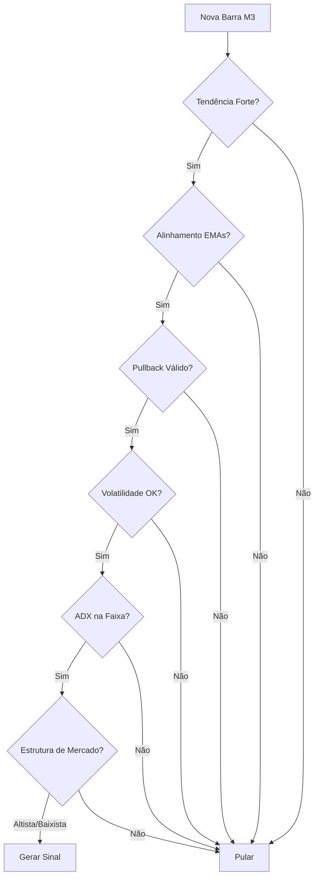

# PA_WIN Expert Advisor

[](https://www.mql5.com/)
[]()
[]()

**[🇺🇸 English](#english)** | **[🇧🇷 Português](#português)**

---

<a name="english"></a>
# 🇺🇸 English Documentation

## 🎯 Overview

PA_WIN is a **signal generation EA** designed for WIN$N (or any symbol) that:

- **Does NOT execute trades** — sends signals/telemetry via UDP to external services
- **Fully JSON-configured** — symbols, timeframes, indicators, and strategies defined in `config.json`
- **Modular architecture** — plug-and-play indicators and strategies
- **Context-oriented** — maintains separate contexts per symbol+timeframe with independent indicator management
- **Production-ready** — designed for Strategy Tester and live signal generation

**Default UDP endpoint:** `127.0.0.1:5005` (JSON format)

---

## 🏗️ Architecture

```
┌─────────────────────────────────────────────────────┐
│                    PA_WIN.mq5                        │
│              (OnInit/OnTick/OnDeinit)                │
└──────────────────┬──────────────────────────────────┘
                   │
         ┌─────────┴─────────┐
         │  CONFIG_MANAGER   │
         │  (config.json)    │
         └─────────┬─────────┘
                   │
      ┌────────────┴───────────┐
      │                        │
┌─────▼─────┐          ┌──────▼──────┐
│  TF_CTX   │          │ STRATEGY_CTX│
│ (Per TF)  │◄─────────┤  (Setups)   │
└─────┬─────┘          └──────┬──────┘
      │                       │
      │                       │
┌─────▼──────────┐    ┌──────▼────────┐
│IndicatorFactory│    │StrategyFactory│
└────────────────┘    └───────────────┘
         │                    │
         │                    │
    ┌────▼─────┐         ┌───▼────┐
    │Indicators│         │Strategy│
    │  (ADX,   │         │ Classes│
    │ ATR, MA, │         │(EMAs...)│
    │ VWAP...) │         └────┬───┘
    └──────────┘              │
                              │
                     ┌────────▼────────┐
                     │ FrancisSocket   │
                     │ (UDP JSON Out)  │
                     └─────────────────┘
```

### Core Components

| Component | Purpose |
|-----------|---------|
| **TF_CTX** | Timeframe contexts — manages indicators, new bar detection, buffer access |
| **STRATEGY_CTX** | Groups and executes strategies per setup configuration |
| **IndicatorFactory** | Instantiates indicators from config types |
| **StrategyFactory** | Instantiates strategy classes (e.g., `emas_buy_bull`) |
| **FrancisSocket** | UDP client — sends JSON telemetry to external services |
| **CONFIG_MANAGER** | Parses `config.json` and builds contexts/strategies |

---

## ⚙️ Configuration

### Input Parameter

```mql5
input string JsonConfigFile = "config.json";
```

### config.json Structure

#### Symbols Section

Configure per-symbol, per-timeframe settings:

```json
{
  "SYMBOLS": {
    "WIN$N": {
      "M15": {
        "enabled": true,
        "num_candles": 500,
        "indicators": [
          {"type": "ADX", "period": 11},
          {"type": "ATR", "period": 13},
          {"type": "MA", "method": "EMA", "period": 9},
          {"type": "MA", "method": "EMA", "period": 21},
          {"type": "MA", "method": "EMA", "period": 50},
          {"type": "MA", "method": "SMA", "period": 200},
          {"type": "VWAP", "period": 14, "session": "D1"},
          {"type": "BOLL", "period": 21, "deviation": 2.0},
          {"type": "VOL"}
        ]
      },
      "M3": { /* Similar structure */ }
    }
  }
}
```

**Supported Indicators:** ADX, ATR, MA (EMA/SMA), BOLL, FIBO, SUPRES, TRENDLINE, VOL, VWAP

#### Strategies Section

Define setups with strategy lists:

```json
{
  "STRATEGIES": {
    "Conservative_Setup": {
      "enabled": true,
      "strategies": [
        {
          "name": "m15_m3_emas_buy_bull",
          "type": "emas_buy_bull",
          "authorized_timeframes": ["M3"],
          "risk_percent": 1.0,
          "stop_loss_pips": 50.0,
          "take_profit_ratio": 2.0,
          "min_ema_distance": {
            "M3": {"9_21": 0.05, "21_50": 0.10},
            "M15": {"9_21": 0.09, "21_50": 0.15}
          },
          "lookback_candles": 3,
          "max_duration_candles": 3,
          "max_distance_atr": 0.8,
          "volatility_filter": {
            "min_volatility_ratio": 0.7,
            "max_volatility_ratio": 1.5
          },
          "adx_filter": {"adx_min": 17, "adx_max": 70},
          "enable_m15_ema_alignment": true,
          "enable_m3_ema_alignment": true,
          "enable_m15_strong_trend": true,
          "enable_m3_strong_trend": true,
          "enable_ema9_pullback": true,
          "enable_ema21_pullback": true,
          "enable_m15_structure": true,
          "enable_m3_structure": true
        }
      ]
    }
  }
}
```

---

## 🔄 Execution Flow

### OnInit()

1. Customizes Strategy Tester chart appearance
2. Initializes UDP socket (`FrancisSocket`)
3. Sends "started" status message
4. Loads `config.json` via `CONFIG_MANAGER`
5. Creates `TF_CTX` contexts and `STRATEGY_CTX` setups
6. Sets new bar control to `PERIOD_CURRENT`

### OnTick()

1. Executes only on new bar (`ExecuteOnNewBar()`)
2. For each configured symbol: `UpdateSymbolContexts(symbol)`
3. Within each context:
   - If `ctx.HasNewBar()` → `ctx.Update()` (refresh indicators)
   - For each related `STRATEGY_CTX`: call `Update(symbol, tf)`
   - Each strategy checks signals and emits JSON if authorized for the timeframe

### OnDeinit()

1. Releases `CONFIG_MANAGER` resources
2. Calls `CIndicatorFactory::Cleanup()`
3. Closes UDP socket

---

## 📊 Strategy Logic: EMAs Strategy

### Active Strategies

- **m15_m3_emas_buy_bull** — Bullish entries (authorized on M3)
- **m15_m3_emas_sell_bear** — Bearish entries (authorized on M3)

### Signal Validation Process



### Key Filters

| Filter | Description | Configuration |
|--------|-------------|---------------|
| **Strong Trend** | EMAs distance ≥ threshold (normalized by ATR) | `min_ema_distance` per TF |
| **EMA Alignment** | 9 > 21 > 50 (bull) or 9 < 21 < 50 (bear) | M15 + M3 checks |
| **Valid Pullback** | Price retraces to EMA9/21 without breaking trend | `enable_ema9_pullback` |
| **Volatility** | ATR ratio within [0.7, 1.5] | `volatility_filter` |
| **ADX Range** | Momentum filter [17, 70] | `adx_filter` |
| **Structure** | Bullish/bearish candle patterns | M15 + M3 structure checks |
| **Bollinger** | Width/position validation | Used in structure validation |

### Risk Parameters

- **Position Size:** `risk_percent` (default 1.0%)
- **Stop Loss:** `stop_loss_pips` (default 50 pips)
- **Take Profit:** `take_profit_ratio × SL` (default 2:1)

---

## 📡 Network Output (UDP JSON)

### Message Types

#### 1. Status Messages
```json
{
  "type": "status",
  "message": "EA started successfully",
  "timestamp": "2025-10-20 14:30:00"
}
```

#### 2. Analysis Messages
```json
{
  "type": "analysis",
  "symbol": "WIN$N",
  "timeframe": "M3",
  "indicator": "EMA_9",
  "value": 125430.5,
  "details": { /* ... */ }
}
```

#### 3. Position Snapshots
```json
{
  "type": "positions",
  "positions": [
    {
      "ticket": 12345,
      "symbol": "WIN$N",
      "type": "BUY",
      "volume": 1.0,
      "price": 125400.0,
      "sl": 124900.0,
      "tp": 126400.0
    }
  ]
}
```

#### 4. Signal/Order Messages
```json
{
  "type": "order",
  "action": "BUY",
  "symbol": "WIN$N",
  "volume": 1.0,
  "sl": 124900.0,
  "tp": 126400.0,
  "strategy": "m15_m3_emas_buy_bull",
  "timestamp": "2025-10-20 14:35:00"
}
```

**⚠️ Note:** UDP does not guarantee delivery. Implement acknowledgment/retry logic in your consumer if reliability is critical.

---

## 🧪 Testing

### Strategy Tester Setup

1. Set `JsonConfigFile = "config.json"`
2. Enable only necessary timeframes/indicators to optimize speed
3. Monitor:
   - **Journal** for initialization/parsing errors
   - **UDP consumer** for signal output
   - **Expert logs** for strategy validations

### Quick Test Configuration

Disable non-essential setups:

```json
{
  "STRATEGIES": {
    "Conservative_Setup": {"enabled": true},
    "Risky_Setup": {"enabled": false},
    "Moderate_Setup": {"enabled": false}
  }
}
```

---

## 🔧 Extending the EA

### Adding a New Indicator

1. Create class in `TF_CTX/indicators/<new_indicator>.mqh`
2. Define config in `indicators_types.mqh`
3. Register in `IndicatorFactory::Create()`
4. Reference in `config.json`

Example:
```cpp
// indicators/rsi.mqh
class CRSI : public CIndicatorBase {
    // Implementation
};
```

### Adding a New Strategy

1. Create class derived from `CStrategyBase` in `STRATEGIES/strategies/<new_strategy>/`
2. Define config struct in `strategies_types.mqh`
3. Register in `StrategyFactory::Create()`
4. Update `strategy_ctx_parser.mqh` if needed
5. Add to `config.json` setup

Example:
```cpp
// strategies/macd_strategy/macd_buy.mqh
class CMACDBuyStrategy : public CStrategyBase {
    virtual bool CheckForSignal() override;
    virtual bool ValidateSignal() override;
};
```

### Native Order Execution

To execute trades directly:

1. Integrate `<Trade/Trade.mqh>` and `CTrade` class
2. Create `TradeProvider` layer
3. Implement risk management using `risk_percent`, `stop_loss_pips`, `take_profit_ratio`
4. Call `CTrade::OrderSend()` in strategy validation
5. Add position tracking and management

---

## 📁 Project Structure

```
PA_WIN/
├── PA_WIN.mq5                    # Main EA file
├── config.json                   # Configuration file
│
├── CONFIG_MANAGER/
│   ├── config_manager.mqh
│   ├── strategy_ctx_parser.mqh
│   └── tf_ctx_parser.mqh
│
├── TF_CTX/
│   ├── tf_ctx.mqh                # Timeframe context
│   ├── factories/
│   │   └── indicator_factory.mqh
│   └── indicators/
│       ├── indicator_base.mqh
│       ├── adx.mqh
│       ├── atr.mqh
│       ├── bollinger.mqh
│       ├── ma.mqh
│       ├── vwap.mqh
│       └── ...
│
├── STRATEGIES/
│   ├── strategy_ctx.mqh          # Strategy context manager
│   ├── factories/
│   │   └── strategy_factory.mqh
│   └── strategies/
│       ├── strategy_base/
│       │   └── strategy_base.mqh
│       └── emas_strategy/
│           ├── emas_buy_bull.mqh
│           └── emas_sell_bear.mqh
│
├── PROVIDER/
│   ├── francis_socket.mqh        # UDP client singleton
│   └── francis_the_socket.mq5
│
├── utils/
│   ├── JAson.mqh                 # JSON parser
│   ├── conversion.mqh
│   ├── tester_qol.mqh
│   └── common_types.mqh
│
└── interfaces/
    ├── icontext_provider.mqh
    ├── inetwork_client.mqh
    └── istrategy.mqh
```

---

## ⚠️ Important Notes

### Limitations

- **No Direct Trading:** EA generates signals only; external system must execute trades
- **UDP Reliability:** No guaranteed message delivery — implement consumer-side validation
- **New Bar Control:** Global `m_control_tf` + per-context `HasNewBar()` prevents intra-bar recalculation
- **Config Dependency:** Indicator names in config must match strategy references exactly

### Best Practices

- Monitor UDP consumer logs to verify signal reception
- Use Strategy Tester to validate signal generation before live deployment
- Maintain config.json version control for different market conditions
- Implement consumer-side position management and risk controls

---

## 📝 License

MIT License - Feel free to modify and distribute

---

## 🤝 Contributing

Contributions are welcome! Please:

1. Fork the repository
2. Create a feature branch
3. Add tests for new indicators/strategies
4. Submit a pull request

---

## 📞 Support

For issues or questions:
- Open an issue on GitHub
- Check the Strategy Tester Journal for debugging
- Verify `config.json` syntax with a JSON validator

---

<a name="português"></a>
# 🇧🇷 Documentação em Português

## 🎯 Visão Geral

PA_WIN é um **EA gerador de sinais** projetado para WIN$N (ou qualquer símbolo) que:

- **NÃO executa trades** — envia sinais/telemetria via UDP para serviços externos
- **Totalmente configurado via JSON** — símbolos, timeframes, indicadores e estratégias definidos em `config.json`
- **Arquitetura modular** — indicadores e estratégias plug-and-play
- **Orientado a contexto** — mantém contextos separados por símbolo+timeframe com gerenciamento independente de indicadores
- **Pronto para produção** — projetado para Strategy Tester e geração de sinais ao vivo

**Endpoint UDP padrão:** `127.0.0.1:5005` (formato JSON)

---

## 🏗️ Arquitetura

### Componentes Principais

| Componente | Propósito |
|-----------|-----------|
| **TF_CTX** | Contextos de timeframe — gerencia indicadores, detecção de nova barra, acesso a buffers |
| **STRATEGY_CTX** | Agrupa e executa estratégias por configuração de setup |
| **IndicatorFactory** | Instancia indicadores a partir dos tipos de configuração |
| **StrategyFactory** | Instancia classes de estratégia (ex.: `emas_buy_bull`) |
| **FrancisSocket** | Cliente UDP — envia telemetria JSON para serviços externos |
| **CONFIG_MANAGER** | Faz parse do `config.json` e constrói contextos/estratégias |

---

## ⚙️ Configuração

### Parâmetro de Entrada

```mql5
input string JsonConfigFile = "config.json";
```

### Estrutura do config.json

#### Seção de Símbolos

Configure por símbolo e por timeframe:

```json
{
  "SYMBOLS": {
    "WIN$N": {
      "M15": {
        "enabled": true,
        "num_candles": 500,
        "indicators": [
          {"type": "ADX", "period": 11},
          {"type": "ATR", "period": 13},
          {"type": "MA", "method": "EMA", "period": 9},
          {"type": "MA", "method": "EMA", "period": 21},
          {"type": "MA", "method": "EMA", "period": 50},
          {"type": "MA", "method": "SMA", "period": 200},
          {"type": "VWAP", "period": 14, "session": "D1"},
          {"type": "BOLL", "period": 21, "deviation": 2.0},
          {"type": "VOL"}
        ]
      },
      "M3": { /* Estrutura similar */ }
    }
  }
}
```

**Indicadores Suportados:** ADX, ATR, MA (EMA/SMA), BOLL, FIBO, SUPRES, TRENDLINE, VOL, VWAP

#### Seção de Estratégias

Defina setups com listas de estratégias:

```json
{
  "STRATEGIES": {
    "Conservative_Setup": {
      "enabled": true,
      "strategies": [
        {
          "name": "m15_m3_emas_buy_bull",
          "type": "emas_buy_bull",
          "authorized_timeframes": ["M3"],
          "risk_percent": 1.0,
          "stop_loss_pips": 50.0,
          "take_profit_ratio": 2.0,
          "min_ema_distance": {
            "M3": {"9_21": 0.05, "21_50": 0.10},
            "M15": {"9_21": 0.09, "21_50": 0.15}
          },
          "lookback_candles": 3,
          "max_duration_candles": 3,
          "max_distance_atr": 0.8,
          "volatility_filter": {
            "min_volatility_ratio": 0.7,
            "max_volatility_ratio": 1.5
          },
          "adx_filter": {"adx_min": 17, "adx_max": 70},
          "enable_m15_ema_alignment": true,
          "enable_m3_ema_alignment": true,
          "enable_m15_strong_trend": true,
          "enable_m3_strong_trend": true,
          "enable_ema9_pullback": true,
          "enable_ema21_pullback": true,
          "enable_m15_structure": true,
          "enable_m3_structure": true
        }
      ]
    }
  }
}
```

---

## 🔄 Fluxo de Execução

### OnInit()

1. Personaliza aparência do gráfico no Strategy Tester
2. Inicializa socket UDP (`FrancisSocket`)
3. Envia mensagem de status "iniciado"
4. Carrega `config.json` via `CONFIG_MANAGER`
5. Cria contextos `TF_CTX` e setups `STRATEGY_CTX`
6. Define controle de nova barra para `PERIOD_CURRENT`

### OnTick()

1. Executa apenas em nova barra (`ExecuteOnNewBar()`)
2. Para cada símbolo configurado: `UpdateSymbolContexts(symbol)`
3. Dentro de cada contexto:
   - Se `ctx.HasNewBar()` → `ctx.Update()` (atualiza indicadores)
   - Para cada `STRATEGY_CTX` relacionado: chama `Update(symbol, tf)`
   - Cada estratégia verifica sinais e emite JSON se autorizado para o timeframe

### OnDeinit()

1. Libera recursos do `CONFIG_MANAGER`
2. Chama `CIndicatorFactory::Cleanup()`
3. Fecha socket UDP

---

## 📊 Lógica de Estratégia: Estratégia EMAs

### Estratégias Ativas

- **m15_m3_emas_buy_bull** — Entradas de compra (autorizada em M3)
- **m15_m3_emas_sell_bear** — Entradas de venda (autorizada em M3)

### Processo de Validação de Sinal



### Filtros Principais

| Filtro | Descrição | Configuração |
|--------|-----------|--------------|
| **Tendência Forte** | Distância EMAs ≥ limite (normalizado por ATR) | `min_ema_distance` por TF |
| **Alinhamento EMA** | 9 > 21 > 50 (alta) ou 9 < 21 < 50 (baixa) | Verificações M15 + M3 |
| **Pullback Válido** | Preço retrai até EMA9/21 sem quebrar tendência | `enable_ema9_pullback` |
| **Volatilidade** | Razão ATR dentro de [0.7, 1.5] | `volatility_filter` |
| **Faixa ADX** | Filtro de momentum [17, 70] | `adx_filter` |
| **Estrutura** | Padrões de candles altistas/baixistas | Verificações estrutura M15 + M3 |
| **Bollinger** | Validação de largura/posição | Usado na validação de estrutura |

### Parâmetros de Risco

- **Tamanho da Posição:** `risk_percent` (padrão 1.0%)
- **Stop Loss:** `stop_loss_pips` (padrão 50 pips)
- **Take Profit:** `take_profit_ratio × SL` (padrão 2:1)

---

## 📡 Saída de Rede (UDP JSON)

### Tipos de Mensagem

#### 1. Mensagens de Status
```json
{
  "type": "status",
  "message": "EA iniciado com sucesso",
  "timestamp": "2025-10-20 14:30:00"
}
```

#### 2. Mensagens de Análise
```json
{
  "type": "analysis",
  "symbol": "WIN$N",
  "timeframe": "M3",
  "indicator": "EMA_9",
  "value": 125430.5,
  "details": { /* ... */ }
}
```

#### 3. Snapshots de Posição
```json
{
  "type": "positions",
  "positions": [
    {
      "ticket": 12345,
      "symbol": "WIN$N",
      "type": "BUY",
      "volume": 1.0,
      "price": 125400.0,
      "sl": 124900.0,
      "tp": 126400.0
    }
  ]
}
```

#### 4. Mensagens de Sinal/Ordem
```json
{
  "type": "order",
  "action": "BUY",
  "symbol": "WIN$N",
  "volume": 1.0,
  "sl": 124900.0,
  "tp": 126400.0,
  "strategy": "m15_m3_emas_buy_bull",
  "timestamp": "2025-10-20 14:35:00"
}
```

**⚠️ Nota:** UDP não garante entrega. Implemente lógica de confirmação/retry no seu consumidor se confiabilidade for crítica.

---

## 🧪 Testes

### Configuração do Strategy Tester

1. Defina `JsonConfigFile = "config.json"`
2. Habilite apenas timeframes/indicadores necessários para otimizar velocidade
3. Monitore:
   - **Journal** para erros de inicialização/parsing
   - **Consumidor UDP** para saída de sinais
   - **Logs do Expert** para validações de estratégia

### Configuração de Teste Rápido

Desabilite setups não essenciais:

```json
{
  "STRATEGIES": {
    "Conservative_Setup": {"enabled": true},
    "Risky_Setup": {"enabled": false},
    "Moderate_Setup": {"enabled": false}
  }
}
```

---

## 🔧 Estendendo o EA

### Adicionando um Novo Indicador

1. Crie classe em `TF_CTX/indicators/<novo_indicador>.mqh`
2. Defina config em `indicators_types.mqh`
3. Registre em `IndicatorFactory::Create()`
4. Referencie em `config.json`

Exemplo:
```cpp
// indicators/rsi.mqh
class CRSI : public CIndicatorBase {
    // Implementação
};
```

### Adicionando uma Nova Estratégia

1. Crie classe derivada de `CStrategyBase` em `STRATEGIES/strategies/<nova_estrategia>/`
2. Defina struct de config em `strategies_types.mqh`
3. Registre em `StrategyFactory::Create()`
4. Atualize `strategy_ctx_parser.mqh` se necessário
5. Adicione ao setup em `config.json`

Exemplo:
```cpp
// strategies/macd_strategy/macd_buy.mqh
class CMACDBuyStrategy : public CStrategyBase {
    virtual bool CheckForSignal() override;
    virtual bool ValidateSignal() override;
};
```

### Execução Nativa de Ordens

Para executar trades diretamente:

1. Integre `<Trade/Trade.mqh>` e classe `CTrade`
2. Crie camada `TradeProvider`
3. Implemente gerenciamento de risco usando `risk_percent`, `stop_loss_pips`, `take_profit_ratio`
4. Chame `CTrade::OrderSend()` na validação da estratégia
5. Adicione rastreamento e gerenciamento de posições

---

## 📁 Estrutura do Projeto

```
PA_WIN/
├── PA_WIN.mq5                    # Arquivo principal do EA
├── config.json                   # Arquivo de configuração
│
├── CONFIG_MANAGER/
│   ├── config_manager.mqh
│   ├── strategy_ctx_parser.mqh
│   └── tf_ctx_parser.mqh
│
├── TF_CTX/
│   ├── tf_ctx.mqh                # Contexto de timeframe
│   ├── factories/
│   │   └── indicator_factory.mqh
│   └── indicators/
│       ├── indicator_base.mqh
│       ├── adx.mqh
│       ├── atr.mqh
│       ├── bollinger.mqh
│       ├── ma.mqh
│       ├── vwap.mqh
│       └── ...
│
├── STRATEGIES/
│   ├── strategy_ctx.mqh          # Gerenciador de contexto de estratégia
│   ├── factories/
│   │   └── strategy_factory.mqh
│   └── strategies/
│       ├── strategy_base/
│       │   └── strategy_base.mqh
│       └── emas_strategy/
│           ├── emas_buy_bull.mqh
│           └── emas_sell_bear.mqh
│
├── PROVIDER/
│   ├── francis_socket.mqh        # Cliente UDP singleton
│   └── francis_the_socket.mq5
│
├── utils/
│   ├── JAson.mqh                 # Parser JSON
│   ├── conversion.mqh
│   ├── tester_qol.mqh
│   └── common_types.mqh
│
└── interfaces/
    ├── icontext_provider.mqh
    ├── inetwork_client.mqh
    └── istrategy.mqh
```

---

## ⚠️ Notas Importantes

### Limitações

- **Sem Trading Direto:** EA gera apenas sinais; sistema externo deve executar trades
- **Confiabilidade UDP:** Sem garantia de entrega de mensagens — implemente validação no lado do consumidor
- **Controle de Nova Barra:** `m_control_tf` global + `HasNewBar()` por contexto previne recálculo intra-barra
- **Dependência de Config:** Nomes de indicadores no config devem corresponder exatamente às referências nas estratégias

### Boas Práticas

- Monitore logs do consumidor UDP para verificar recepção de sinais
- Use Strategy Tester para validar geração de sinais antes de implantação ao vivo
- Mantenha controle de versão do config.json para diferentes condições de mercado
- Implemente gerenciamento de posições e controles de risco no lado do consumidor

---

## 📝 Licença

Licença MIT - Sinta-se livre para modificar e distribuir

---

## 🤝 Contribuindo

Contribuições são bem-vindas! Por favor:

1. Faça fork do repositório
2. Crie uma branch de feature
3. Adicione testes para novos indicadores/estratégias
4. Envie um pull request

---

## 📞 Suporte

Para problemas ou questões:
- Abra uma issue no GitHub
- Verifique o Journal do Strategy Tester para debugging
- Valide a sintaxe do `config.json` com um validador JSON

---

## 📚 Recursos Adicionais

### Documentação Técnica

- [MQL5 Reference](https://www.mql5.com/en/docs)
- [Strategy Tester Guide](https://www.mql5.com/en/articles/1486)
- [JSON Configuration Best Practices](https://www.json.org/)

### Tutoriais Recomendados

- Como criar indicadores personalizados em MQL5
- Integração UDP com Python/Node.js
- Gerenciamento de risco em trading algorítmico

### Comunidade

- [MQL5 Forum](https://www.mql5.com/en/forum)
- [Trading Systems Discussion](https://www.mql5.com/en/forum/173)

---

## 🔍 Troubleshooting

### Problemas Comuns

**EA não inicializa:**
- Verifique se `config.json` está na pasta correta (`MQL5/Files/`)
- Valide sintaxe JSON usando um validador online
- Confira o Journal para mensagens de erro de parsing

**Sinais não chegam via UDP:**
- Verifique se o consumidor UDP está rodando em `127.0.0.1:5005`
- Confirme que o firewall não está bloqueando a porta
- Use Wireshark para monitorar tráfego UDP

**Indicadores retornam valores inválidos:**
- Certifique-se de que `num_candles` é suficiente para o período do indicador
- Verifique se o símbolo tem dados históricos disponíveis
- Confirme que os nomes dos indicadores no config correspondem aos esperados pelas estratégias

**Estratégias não geram sinais:**
- Verifique se `authorized_timeframes` inclui o timeframe atual
- Confirme que o setup está `enabled: true`
- Monitore logs de validação no Journal para entender quais filtros estão falhando

---

## 🚀 Roadmap

### Versão Atual (v1.0)
- ✅ Geração de sinais via UDP
- ✅ Configuração JSON completa
- ✅ Estratégias EMAs (Bull/Bear)
- ✅ Múltiplos indicadores suportados
- ✅ Validação multi-timeframe

### Próximas Versões

**v1.1 - Melhorias de Confiabilidade**
- 🔲 Protocolo TCP como alternativa ao UDP
- 🔲 Sistema de confirmação de entrega (ACK)
- 🔲 Reconexão automática em caso de falha
- 🔲 Buffer de mensagens para retry

**v1.2 - Expansão de Estratégias**
- 🔲 Estratégias baseadas em RSI
- 🔲 Estratégias de breakout
- 🔲 Estratégias de reversão à média
- 🔲 Combinações multi-indicadores

**v1.3 - Analytics e Reporting**
- 🔲 Dashboard web para monitoramento
- 🔲 Métricas de performance por estratégia
- 🔲 Backtesting automatizado com relatórios
- 🔲 Alertas configuráveis

**v2.0 - Execução Nativa**
- 🔲 Integração CTrade para execução direta
- 🔲 Gerenciamento automático de posições
- 🔲 Trailing stop inteligente
- 🔲 Dimensionamento dinâmico de posição

---

## 💡 Use Cases

### 1. Sistema de Copy Trading
Configure o EA em uma conta master e distribua sinais para múltiplas contas via UDP:
```
[MT5 Master] --UDP--> [Signal Distributor] ---> [MT5 Client 1]
                                           ---> [MT5 Client 2]
                                           ---> [MT5 Client 3]
```

### 2. Análise Multi-Timeframe
Use os dados de análise JSON para construir dashboards personalizados:
```python
# Exemplo em Python
import socket
import json

sock = socket.socket(socket.AF_INET, socket.SOCK_DGRAM)
sock.bind(('127.0.0.1', 5005))

while True:
    data, addr = sock.recvfrom(4096)
    signal = json.loads(data)
    
    if signal['type'] == 'analysis':
        # Processar dados de indicadores
        print(f"{signal['indicator']}: {signal['value']}")
```

### 3. Backtesting com Dados Reais
Execute no Strategy Tester e colete todos os sinais para análise posterior:
```javascript
// Exemplo em Node.js
const dgram = require('dgram');
const fs = require('fs');

const server = dgram.createSocket('udp4');
const signals = [];

server.on('message', (msg, rinfo) => {
    const signal = JSON.parse(msg);
    signals.push(signal);
});

server.on('close', () => {
    fs.writeFileSync('backtest_signals.json', JSON.stringify(signals));
});

server.bind(5005);
```

### 4. Machine Learning Integration
Use sinais históricos para treinar modelos de ML:
```python
import pandas as pd
from sklearn.ensemble import RandomForestClassifier

# Carregar sinais históricos
signals = pd.read_json('backtest_signals.json')

# Features: indicadores técnicos
features = signals[['adx', 'atr', 'ema_9', 'ema_21', 'ema_50']]

# Target: resultado do trade
targets = signals['trade_result']  # 1 = lucro, 0 = prejuízo

# Treinar modelo
model = RandomForestClassifier()
model.fit(features, targets)
```

---

## 🎓 Conceitos Avançados

### Gerenciamento de Contexto Multi-Timeframe

O PA_WIN implementa um sistema sofisticado de gerenciamento de contexto que permite:

1. **Isolamento de Indicadores:** Cada timeframe mantém suas próprias instâncias de indicadores
2. **Sincronização Inteligente:** Estratégias podem consultar múltiplos timeframes simultaneamente
3. **Otimização de Recursos:** Indicadores são calculados apenas quando há nova barra

```cpp
// Exemplo conceitual de acesso multi-TF
bool CStrategyBase::IsMultiTimeframeAligned() {
    // Consulta M15
    double ema9_m15 = m_context_provider.GetIndicatorValue(
        m_symbol, PERIOD_M15, "EMA_9", 0
    );
    
    // Consulta M3
    double ema9_m3 = m_context_provider.GetIndicatorValue(
        m_symbol, PERIOD_M3, "EMA_9", 0
    );
    
    // Lógica de alinhamento
    return (ema9_m15 > ema9_m3);
}
```

### Sistema de Validação em Camadas

As estratégias EMAs implementam validação em múltiplas camadas:

1. **Camada 1 - Estrutura Base:** Alinhamento de EMAs
2. **Camada 2 - Confirmação de Tendência:** Força e direção via ATR
3. **Camada 3 - Filtros de Qualidade:** ADX, volatilidade, volume
4. **Camada 4 - Estrutura de Mercado:** Padrões de candles, suporte/resistência
5. **Camada 5 - Timing:** Pullbacks e janelas temporais

Este design em camadas garante alta qualidade de sinais ao custo de menor frequência.

### Performance e Otimização

**Boas Práticas de Config:**

```json
{
  "SYMBOLS": {
    "WIN$N": {
      "M15": {
        "num_candles": 500,  // Suficiente para SMA200
        "indicators": [
          // Evite duplicação de indicadores similares
          {"type": "MA", "method": "EMA", "period": 9},
          // Use apenas os indicadores necessários
        ]
      }
    }
  }
}
```

**Otimização de Memória:**
- Minimize `num_candles` ao estritamente necessário
- Remova indicadores não utilizados pelas estratégias ativas
- Desabilite timeframes não essenciais

**Otimização de CPU:**
- Use `authorized_timeframes` para limitar avaliações
- Configure `lookback_candles` para janelas menores
- Desabilite setups inativos

---

## 🔐 Segurança

### Considerações de Rede

- **UDP não criptografado:** Sinais são enviados em texto plano
- **Sem autenticação:** Qualquer processo pode escutar na porta 5005
- **Risco de spoofing:** Mensagens falsas podem ser injetadas

**Recomendações para Produção:**

1. Use VPN ou túnel SSH para comunicação entre servidores
2. Implemente verificação de hash/assinatura nas mensagens
3. Use whitelist de IPs no consumidor
4. Considere implementar autenticação via token JWT

```python
# Exemplo de validação de mensagem
import hmac
import hashlib

SECRET_KEY = b'your-secret-key'

def verify_signal(signal_json, signature):
    expected = hmac.new(SECRET_KEY, signal_json.encode(), hashlib.sha256)
    return hmac.compare_digest(expected.hexdigest(), signature)
```

---

## 📊 Métricas e Monitoramento

### KPIs Recomendados

| Métrica | Descrição | Alvo |
|---------|-----------|------|
| **Signal Frequency** | Sinais por dia | 2-5 |
| **Filter Pass Rate** | % sinais que passam todos os filtros | 15-30% |
| **Win Rate** | % trades lucrativos (histórico) | >55% |
| **Avg Risk/Reward** | Razão média TP/SL | >1.8 |
| **Max Drawdown** | Maior sequência de perdas | <20% |
| **Latency** | Tempo de geração até envio UDP | <50ms |

### Logging Estruturado

Implemente logs estruturados para análise:

```json
{
  "timestamp": "2025-10-20T14:35:22.123Z",
  "event": "signal_generated",
  "strategy": "m15_m3_emas_buy_bull",
  "symbol": "WIN$N",
  "timeframe": "M3",
  "filters": {
    "strong_trend": true,
    "ema_alignment": true,
    "valid_pullback": true,
    "volatility_ok": true,
    "adx_range": true,
    "structure": "bullish"
  },
  "indicators": {
    "ema_9": 125430.5,
    "ema_21": 125380.2,
    "ema_50": 125320.8,
    "atr": 85.3,
    "adx": 24.7
  },
  "signal": {
    "action": "BUY",
    "entry": 125435.0,
    "sl": 124935.0,
    "tp": 126435.0,
    "risk_percent": 1.0
  }
}
```

---

**Built with ❤️ for algorithmic traders**

**Construído com ❤️ para traders algorítmicos**
